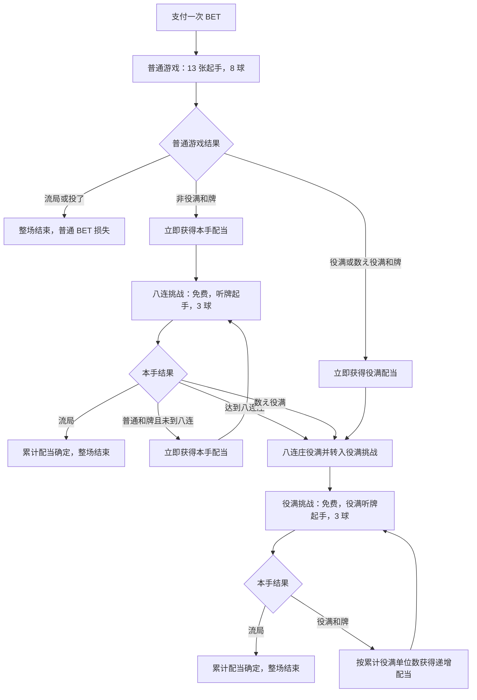

# JanQ 游戏流程、概率模型与现行策略研究报告

> 报告日期：2026-06-14  
> 研究对象：SEGA NET 麻将 MJ 中的赌场游戏 JanQ  
> 研究范围：游戏规则、完整流程、概率、计分、经济结构、现行策略与数学研究方法

## 1. 结论摘要

JanQ 不是“从普通麻将牌山中随机摸牌”的单人麻将，而是一个有限步数、可选择转移分布、带特殊续命机制和多阶段奖金状态的序贯决策问题。

每次决策的核心不是“摸哪张牌”，而是选择 7 个区域之一。区域决定下一张牌的概率分布。摸到牌后，如果没有和牌，玩家再选择弃牌。普通游戏最多从 8 次有效摸牌机会开始；八连挑战和役满挑战从 3 次开始。手中已有 3 张同牌时再摸到第 4 张，会返还 1 次摸牌机会；已有 4 张时再次命中同牌，该次判为无效，不消耗机会并重新发射。

整场游戏的价值不只来自当前一手的直接配当，还来自后续状态：

1. 普通游戏非役满和牌，获得本手配当并进入八连挑战。
2. 普通游戏役满或数え役满和牌，获得本手配当并直接进入役满挑战。
3. 八连挑战连续和牌时持续获得配当；包含普通游戏在内达到八连庄，或中途达成数え役满时，进入役满挑战。
4. 役满挑战每次成功都会提高后续役满配当，直到流局。

因此，普通游戏中某个行动的真实价值应写成：

\[
Q(s,a)
=
\mathbb{E}\left[
\text{当前手配当}
+\text{八连挑战未来价值}
+\text{役满挑战未来价值}
\mid s,a
\right]
\]

而不能只比较“当前向听数是否下降”或“当前役满概率是否上升”。

现行的路线感知 EV 策略并不是严格求解的最优策略，而是一套保守的启发式规则，主要结构为：

- 役满听牌绝不拆；
- 普通听牌在剩余 3 球或更少时通常立直并锁手；
- 只有役满路线足够近、估算成功概率超过阈值时才追役满；
- 混一色作为次级路线；
- 其他情况优先保持最低向听数，并按下一次区域的有效进张概率选牌；
- 区域评价同时考虑进张、直接和牌和摸到第 4 张后的返球概率。

当前最重要的研究结论是：

1. 7 个区域的摸牌概率可以用明确的概率矩阵建模。
2. 第 4 张返球与第 5 张无效重发，使球数过程成为状态相关的随机过程。
3. 普通和牌的价值必须包含进入八连挑战或役满挑战的后续价值。
4. 普通起手和特殊模式起手的真实分布并未由公开规则完整规定，应作为未知分布处理。
5. 现行策略是路线感知启发式，而不是已经由动态规划证明的最优策略。

---

## 2. 规则、假设与策略参数的区分

| 标签 | 含义 |
|---|---|
| 明确规则 | 游戏流程、配当表或特殊裁定中明确规定的内容 |
| 数学推论 | 从明确规则和概率矩阵直接推导出的结论 |
| 分布假设 | 公开规则未规定、研究时必须额外设定的随机分布 |
| 策略启发式 | 人工设定的价值、阈值或排序，不是官方参数 |
| 未决问题 | 缺少足够信息，不能唯一确定的游戏机制或概率 |

数学研究时必须保留这一区分。尤其不能把策略中的 \(330\)、\(360\)、\(1.35\) 等常数解释为官方赔率、真实配当或已经证明的货币价值。

---

## 3. 基础对象与记号

### 3.1 牌种

JanQ 使用 34 种标准麻将牌：

- 万子：`1m` 至 `9m`
- 索子：`1s` 至 `9s`
- 筒子：`1p` 至 `9p`
- 字牌：东 `E`、南 `S`、西 `W`、北 `N`、白 `P`、发 `F`、中 `C`

每种牌的正常最大持有数为 4。

### 3.2 手牌状态

用长度为 34 的计数向量表示手牌：

\[
\mathbf{n}=(n_0,n_1,\ldots,n_{33}),\qquad n_i\in\{0,1,2,3,4\}
\]

发射前通常有 13 张牌：

\[
\sum_i n_i=13
\]

有效摸牌后暂时有 14 张：

\[
\sum_i n_i=14
\]

若未和牌，则选择一张牌弃掉，回到 13 张。

### 3.3 完整研究状态

一个足以描述策略的状态可以写成：

\[
s=(m,\mathbf{n},b,d,u,r,t,c_h,c_y)
\]

其中：

- \(m\)：模式，普通游戏、八连挑战或役满挑战；
- \(\mathbf{n}\)：手牌计数；
- \(b\)：剩余有效摸牌次数；
- \(d\)：表面宝牌；
- \(u\)：里宝牌；
- \(r\)：是否已经进入立直锁手状态；
- \(t\)：当前手内的回合位置；
- \(c_h\)：八连挑战的累计和牌次数；
- \(c_y\)：役满挑战累计役满单位数。

若研究整场净收益，还要加入 BET、货币余额和此前已获得的累计配当。

---

## 4. 完整游戏流程

## 4.1 总体状态图

### 4.2 普通游戏

普通游戏是整场唯一需要支付 BET 的入口。

已确认规则：

1. 支付 BET 后发 13 张手牌。
2. 初始拥有 8 次摸牌机会。
3. 显示表面宝牌和里宝牌。
4. 每回合先选择发射区域并摸牌。
5. 摸牌后若和牌，可确认和牌。
6. 未和牌则弃 1 张牌，再进行下一次发射。
7. 听牌时可以立直，且不需要支付通常麻将中的 1000 点。
8. 最后一球摸到和牌时会自动和牌。
9. 普通和牌立即支付本手奖励。
10. 非役满和牌进入八连挑战。
11. 役满或数え役满和牌进入役满挑战。
12. 玩家可以主动投了，BET 不退。
13. 当一次摸牌后“剩余摸牌次数小于或等于当前向听数”时，系统会自动投了。

最后一条对策略非常重要。若摸牌后剩余球数为 \(b\)，当前向听数为 \(x\)，则普通游戏存在终止条件：

\[
b\le x \quad\Longrightarrow\quad \text{自动投了}
\]

这意味着路线可行性不能只检查 \(b>0\)。如果一次摸牌后的向听数没有充分下降，即使理论上仍有球，游戏也可能立即结束。远距离役满路线因此受到比普通“固定回合数模型”更严格的约束。

### 4.3 八连挑战

八连挑战是普通非役满和牌后的免费奖金模式。

已确认规则：

1. 不再支付 BET。
2. 从听牌和立直状态开始。
3. 每手初始 3 球。
4. 摸到和牌牌时自动和牌，不需要再选择。
5. 第一摸和牌不计天和，也不计一发。
6. 每次和牌立即获得本手配当。
7. 和牌后继续下一手八连挑战。
8. 八连庄计数包含最初的普通游戏和牌。
9. 因此，普通游戏和牌算第 1 次，还需要最多 7 次挑战和牌达到第 8 次。
10. 达到八连庄后进入役满挑战。
11. 达到八连庄之前若形成数え役满，也直接进入役满挑战。
12. 任意一手未和牌并流局，整场结束。
13. 普通游戏的和牌翻数越高，官方说明后续八连挑战“越可能获得高配当”。

公开规则只说明：普通游戏的和牌翻数越高，后续八连挑战越可能获得高配当，但没有给出挑战起手的完整概率分布。因此数学上应把八连挑战起手写成条件分布：

\[
G_H(H_0\mid h)
\]

其中 \(H_0\) 为挑战起手，\(h\) 为上一手翻数。没有额外数据时，不应擅自假定所有听牌起手等概率。

### 4.4 役满挑战

役满挑战是整个收益分布的重尾部分。

已确认规则：

1. 不支付新的 BET。
2. 从役满听牌状态开始。
3. 每手初始 3 球。
4. 摸到役满和牌牌时自动和牌。
5. 第一摸和牌不计天和或一发。
6. 和牌后继续下一手役满挑战。
7. 未和牌流局时，整场结束。
8. 役满挑战的单手配当随本轮累计役满和牌次数增加。
9. 重复役满的每一个役满单位都会加入累计计数。

如果第 \(j\) 次役满挑战和牌包含 \(y_j\) 个役满单位，则累计单位数为：

\[
C_j=\sum_{k=1}^{j}y_k
\]

第 \(j\) 次和牌配当为：

\[
R_j=10B\cdot C_j
\]

其中 \(B\) 为普通游戏最初支付的 BET。

如果每次都只是单役满，即 \(y_j=1\)，连续成功 \(r\) 次的役满挑战总配当为：

\[
\sum_{j=1}^{r}10Bj
=5Br(r+1)
\]

因此役满挑战的尾部收益是二次增长，而不是简单的每次固定 10 倍。

---

## 5. 所有模式的共同规则

已确认的共同规则如下：

1. 固定为东场。
2. 不存在亲家和子家。
3. 东、白、发、中可以作为役牌。
4. 南、西、北本身不构成役牌。
5. 没有符，收益只由翻数或役满单位决定。
6. 没有吃、碰、杠。
7. 没有杠宝牌。
8. 没有赤宝牌。
9. 宝牌显示牌本身就是宝牌，不采用普通麻将“指示牌的下一张”为宝牌的规则。
10. 手牌已有 3 张某牌时摸到第 4 张，剩余摸牌次数加 1。
11. 手牌已有 4 张某牌时再次命中该牌，该次无效，不消耗剩余摸牌次数，并重新发射。
12. 摸牌机会耗尽且未和牌时流局。

第 10、11 条意味着 JanQ 的“时间预算”不是固定的 8 次或 3 次独立抽样。持有刻子会产生续命价值，而持有四枚牌会改变有效条件分布。

---

## 6. 7 区域摸牌概率

## 6.1 概率表性质

普通游戏、八连挑战和役满挑战使用同一组 34 牌种乘 7 区域的基础权重。

每个区域的权重总和为 10000，因此原始概率为：

\[
p_a(i)=\frac{w_{a,i}}{10000}
\]

其中 \(a\in\{1,\ldots,7\}\)，\(i\in\{0,\ldots,33\}\)。

## 6.2 完整概率矩阵

表中 `-` 表示原始权重为 0。

|牌|A1|A2|A3|A4|A5|A6|A7|
|---|---:|---:|---:|---:|---:|---:|---:|
|1m|12%|-|-|-|-|-|-|
|2m|12%|-|-|-|-|-|-|
|3m|12%|1%|1%|0.2%|-|-|-|
|4m|12%|2%|1%|0.2%|-|-|-|
|5m|12%|6%|2%|0.4%|-|-|-|
|6m|8%|12%|3%|0.6%|-|-|-|
|7m|5%|12%|4%|0.8%|-|-|-|
|8m|4%|12%|5%|1%|-|-|-|
|9m|3%|12%|2%|0.4%|-|-|-|
|1s|-|7%|11%|2.2%|-|-|-|
|2s|-|6%|12%|2.4%|-|-|-|
|3s|-|5%|12%|2.6%|1%|1%|-|
|4s|-|4%|12%|3%|3%|2%|-|
|5s|-|3%|11%|4.4%|11%|3%|-|
|6s|-|2%|3%|3%|12%|4%|-|
|7s|-|1%|1%|2.6%|12%|5%|-|
|8s|-|-|-|2.4%|12%|6%|-|
|9s|-|-|-|2.2%|11%|7%|-|
|1p|-|-|-|0.4%|2%|12%|3%|
|2p|-|-|-|1%|5%|12%|4%|
|3p|-|-|-|0.8%|4%|12%|5%|
|4p|-|-|-|0.6%|3%|12%|8%|
|5p|-|-|-|0.4%|2%|6%|12%|
|6p|-|-|-|0.2%|1%|2%|12%|
|7p|-|-|-|0.2%|1%|1%|12%|
|8p|-|-|-|-|-|-|12%|
|9p|-|-|-|-|-|-|12%|
|东 E|20%|10%|-|-|-|-|-|
|南 S|-|5%|20%|4%|-|-|-|
|西 W|-|-|-|4%|20%|5%|-|
|北 N|-|-|-|-|-|10%|20%|
|白 P|-|-|-|20%|-|-|-|
|发 F|-|-|-|20%|-|-|-|
|中 C|-|-|-|20%|-|-|-|

## 6.3 区域的直观含义

- A1：低位万子和东最集中。
- A2：高位万子、低位索子、东南过渡。
- A3：低中位索子和南最集中。
- A4：三元牌中心区，白、发、中各 20%，并混入少量中间牌和南西。
- A5：中高位索子、西和少量低中位筒子。
- A6：低中位筒子、北，并混入高位索子。
- A7：中高位筒子和北最集中。

A4 的三元牌总概率为：

\[
P(\text{白或发或中}\mid A4)=0.2+0.2+0.2=0.6
\]

这解释了大三元路线为什么高度依赖 A4。

A1 的东概率为 20%，A3 的南概率为 20%，A5 的西概率为 20%，A7 的北概率为 20%。四风牌沿区域从左到右分布。

---

## 7. 第 4 张返球和第 5 张重发的数学处理

## 7.1 有效条件分布

设当前手牌计数为 \(\mathbf{n}\)。若 \(n_i=4\)，命中牌 \(i\) 会无效重发。因此对策略真正有意义的是“最终有效摸牌”的条件分布：

\[
q_a(i\mid\mathbf{n})
=
\frac{p_a(i)}
{\sum_{j:n_j<4}p_a(j)}
\qquad(n_i<4)
\]

对于 \(n_i=4\) 的牌：

\[
q_a(i\mid\mathbf{n})=0
\]

这与当前模型中的“对不可能的第 5 张反复重采样”一致。

## 7.2 第 4 张牌的球数转移

一次有效摸牌通常先消耗 1 球。若摸牌前 \(n_i=3\)，摸到第 4 张后返还 1 球：

\[
b'
=
b-1+\mathbf{1}[n_i=3]
\]

所以：

- 一般有效摸牌：\(b'=b-1\)
- 摸到第 4 张：\(b'=b\)
- 第 5 张无效重发：状态和 \(b\) 都不变

## 7.3 单次发射的期望球数变化

定义当前三枚牌集合：

\[
T_3(\mathbf{n})=\{i:n_i=3\}
\]

区域 \(a\) 的返球概率为：

\[
\rho_a(\mathbf{n})
=
\sum_{i\in T_3(\mathbf{n})}q_a(i\mid\mathbf{n})
\]

一次有效摸牌后的期望球数变化为：

\[
\mathbb{E}[\Delta b\mid s,a]
=
-1+\rho_a(\mathbf{n})
\]

因此刻子的价值不只是成组或役种价值，还包括延长决策时域的价值。

## 7.4 第 5 张无效牌对物理发射次数的影响

设区域 \(a\) 命中当前四枚牌的原始总概率为：

\[
r_a(\mathbf{n})
=
\sum_{i:n_i=4}p_a(i)
\]

在独立重发近似下，直到获得一次有效牌所需的物理发射次数服从几何分布，期望为：

\[
\mathbb{E}[N_{\text{launch}}]
=
\frac{1}{1-r_a(\mathbf{n})}
\]

但这些无效重发不消耗战略意义上的球数。因此：

- 研究时间和动画长度时，要考虑 \(r_a\)；
- 研究球数和 EV 时，应使用条件分布 \(q_a\)。

第 5 张无效牌只增加物理发射次数，不改变战略球数；第 4 张则会真实改变后续可行动次数。两者必须在数学模型中分开处理。

---

## 8. 和牌、向听与提前终止

## 8.1 支持的和牌结构

和牌结构包括：

1. 标准型：4 面子加 1 雀头；
2. 七对子；
3. 国士无双。

向听数取三者中的最小值：

\[
\operatorname{shanten}(H)
=
\min\{
\operatorname{shanten}_{\text{standard}},
\operatorname{shanten}_{\text{chiitoi}},
\operatorname{shanten}_{\text{kokushi}}
\}
\]

定义：

- \(-1\) 向听：已经和牌；
- \(0\) 向听：听牌；
- \(1\) 向听：一向听。

## 8.2 有效进张

对 13 张手牌 \(H\)，进张集合可写为：

\[
I(H)
=
\{i:\operatorname{shanten}(H+i)<\operatorname{shanten}(H)\}
\]

听牌时，和牌集合为：

\[
W(H)
=
\{i:H+i\text{ 是完整和牌}\}
\]

区域 \(a\) 对某个目标集合 \(G\) 的有效命中概率为：

\[
P_a(G\mid H)
=
\sum_{i\in G}q_a(i\mid H)
\]

## 8.3 固定概率下的至少一次命中

若暂时忽略返球、状态变化和自适应换区，单次命中目标的概率为 \(p\)，剩余 \(b\) 次，则至少命中一次的概率为：

\[
P(\ge1)=1-(1-p)^b
\]

当前策略用这一公式评价普通听牌的粗略成功概率。

## 8.4 多张缺失牌的二项尾近似

当前路线策略把“还缺 \(k\) 张路线牌”近似为 \(b\) 次试验中至少命中 \(k\) 次：

\[
P_{\text{route}}
\approx
\sum_{j=k}^{b}
\binom{b}{j}p^j(1-p)^{b-j}
\]

这是一个启发式近似，不是严格完成概率，原因包括：

1. 不同缺牌通常不是同一种成功事件；
2. 同一张牌重复命中可能不能替代另一种缺牌；
3. 每次摸牌和弃牌后概率会变化；
4. 第 4 张会返球；
5. 第 5 张会条件重采样；
6. 区域可以每回合重新选择；
7. 普通游戏存在自动投了边界。

严格计算应使用状态动态规划或蒙特卡洛树搜索，而不是单一二项尾概率。

---

## 9. 采用役种与翻数

## 9.1 1 翻役

- 门前清自摸和
- 立直
- 一发
- 平和
- 断幺九
- 一杯口
- 白
- 发
- 中
- 东
- 宝牌，每张 1 翻

## 9.2 2 翻役

- 双立直
- 混全带幺九
- 三色同顺
- 一气通贯
- 三色同刻
- 三暗刻
- 七对子
- 小三元

## 9.3 3 翻役

- 二杯口
- 纯全带幺九
- 混一色

## 9.4 6 翻役

- 清一色

## 9.5 役满

- 国士无双
- 四暗刻
- 大三元
- 字一色
- 小四喜
- 大四喜
- 绿一色
- 九莲宝灯
- 清老头
- 天和
- 八连庄

## 9.6 特殊裁定

1. 没有碰，因此通常麻将中的对对和、混老头标准型按四暗刻处理。
2. 七对子形式的混老头按混全带幺九处理。
3. 一发和双立直只在普通游戏采用。
4. 不采用海底摸月。
5. 13 翻或以上为数え役满。
6. 自然役满可以重叠，最多计到四倍役满。
7. 数え役满与自然役满不重叠。
8. 国士无双十三面、四暗刻单骑、大四喜和纯正九莲宝灯在 JanQ 中不作为双役满。
9. 八连庄只在八连挑战成立。

---

## 10. 配当和经济模型

## 10.1 普通游戏与八连挑战

本手配当为：

\[
R=B\cdot M(h)
\]

其中 \(B\) 为最初 BET，\(M(h)\) 为翻数倍率。

|结果|倍率|
|---|---:|
|1 翻|0.2 倍|
|2 翻|0.4 倍|
|3 翻|0.6 倍|
|4 至 5 翻，满贯|1.0 倍|
|6 至 7 翻，跳满|1.5 倍|
|8 至 10 翻，倍满|2.0 倍|
|11 至 12 翻，三倍满|3.0 倍|
|13 翻以上，数え役满|10.0 倍|
|单役满|10.0 倍|
|双役满|20.0 倍|
|三倍役满|30.0 倍|
|四倍役满|40.0 倍|

例如 \(B=10\) 时：

- 1 翻配当 2；
- 3 翻配当 6；
- 4 翻配当 10；
- 6 翻配当 15；
- 8 翻配当 20；
- 11 翻配当 30；
- 单役满配当 100。

## 10.2 净收益、RTP 与 ROI

一场完整会话只在普通游戏开始时支付一次 BET。设整场总配当为 \(R_{\text{session}}\)，则：

\[
\text{Net}=R_{\text{session}}-B
\]

\[
\text{RTP}
=
\frac{\mathbb{E}[R_{\text{session}}]}{B}
\]

\[
\text{ROI}
=
\frac{\mathbb{E}[R_{\text{session}}]-B}{B}
=
\text{RTP}-1
\]

一项策略要在该模型下正期望，必须满足：

\[
\mathbb{E}[R_{\text{session}}]>B
\]

注意：高和牌率不等于高 RTP。一个策略可能降低普通和牌率，却因役满挑战尾部收益而提高平均配当；也可能提高役满频率，但因丢失大量普通和牌和八连挑战入口而降低总 EV。

## 10.3 会话价值的递归表达

设：

- \(V_N(s)\)：普通游戏状态价值；
- \(V_H(s,c)\)：八连挑战状态价值；
- \(V_Y(s,C)\)：役满挑战状态价值。

普通游戏和牌时：

\[
V_N(\text{win})
=
R_{\text{normal}}
+
\begin{cases}
V_Y(s',C_0),&\text{役满或数え役满}\\
V_H(s',1),&\text{其他和牌}
\end{cases}
\]

八连挑战和牌时：

\[
V_H(\text{win},c)
=
R_{\text{hand}}
+
\begin{cases}
V_Y(s',C_0),&c+1=8\text{ 或数え役满}\\
V_H(s',c+1),&\text{其他}
\end{cases}
\]

役满挑战和牌时：

\[
V_Y(\text{win},C)
=
10B(C+y)+V_Y(s',C+y)
\]

流局状态的后续价值为 0，因为此前赢得的配当已经在前面各次和牌时计入。

---

## 11. 当前策略体系

为了比较不同决策思想，可以把普通游戏策略分为三类：

1. 公开攻略型：以染手或三元牌路线为核心。
2. 向听贪心型：优先降低向听数并扩大进张种类。
3. 路线感知 EV 型：现行策略，在普通和牌与高价值路线之间进行启发式比较。

八连挑战和役满挑战使用专门的奖金模式策略。

---

## 12. 公开攻略型基线策略

该策略的逻辑非常简单。

### 12.1 路线选择

1. 若已经听牌，直接选择使和牌集合总概率最大的区域。
2. 若三元牌总数至少为 2，目标集合固定为白、发、中。
3. 否则统计万、索、筒的张数，选择当前张数最多的花色。
4. 区域选择只最大化目标集合的原始概率质量。

### 12.2 弃牌

优先弃掉目标集合之外的牌。

若候选不止一张，倾向弃：

1. 数量更少的牌；
2. 字牌；
3. 幺九牌。

### 12.3 局限

该策略：

- 不直接优化向听数；
- 不考虑下一次区域分布；
- 不考虑返球价值；
- 不评价当前和牌与未来奖金模式的总 EV；
- 可能为了染手过早破坏普通有效形。

它适合作为公开攻略思想的回归基线，不适合作为最优策略。

---

## 13. 向听贪心型基线策略

### 13.1 区域选择

1. 若听牌，选和牌集合概率最大的区域。
2. 否则找所有能降低向听数的牌。
3. 选择这些进张总权重最大的区域。
4. 没有进张时回退到 A4。

### 13.2 弃牌

对每一种可弃牌：

1. 计算弃后向听数；
2. 计算弃后进张牌种数；
3. 先最小化向听数；
4. 再最大化进张牌种数；
5. 最后按牌编号打破平局。

### 13.3 局限

它只计算“进张牌种数”，没有按区域概率加权，也没有考虑翻数、宝牌、奖金模式、返球和役满路线。

---

## 14. 现行路线感知 EV 策略

## 14.1 实际定位

这不是完整 Bellman 搜索，而是由以下部分组成的启发式决策：

- 路线识别；
- 二项尾成功概率近似；
- 听牌价值近似；
- 一步弃牌后区域前视；
- 返球保护；
- 一组人工阈值和价值权重。

因此准确定位是“路线感知的 EV 启发式”，而不是已经求解出的最优策略。

## 14.2 总决策优先级

区域选择的实际优先级：

1. 役满听牌锁定；
2. 已立直的普通听牌锁定；
3. 剩余 3 球或更少的普通听牌；
4. 剩余球数较多时，判断是否存在价值显著更高的听牌改良；
5. 检查活跃役满路线；
6. 检查混一色路线；
7. 普通最低向听数和下一次区域进张；
8. 最后回退到公开攻略型策略。

弃牌选择的实际优先级：

1. 已立直时只摸切；
2. 已和牌时和牌；
3. 役满听牌绝不拆，并声明立直；
4. 比较普通听牌价值与活跃路线价值；
5. 若无路线，保持最低向听数后最大化下一次区域价值；
6. 若有混一色路线，先保持向听数和路线距离；
7. 若有役满路线，先保证路线在剩余球数内可行，再最小化缺牌数和最大化估算成功概率。

## 14.3 区域一步评价

设：

- \(p_{\text{progress}}\)：目标进张概率；
- \(p_{\text{win}}\)：直接和牌概率；
- \(p_{\text{protect}}\)：命中当前三枚牌并返球的概率。

当前区域分数为：

\[
S_a
=
p_{\text{progress}}
+0.35p_{\text{win}}
+0.25p_{\text{protect}}
\]

选择 \(S_a\) 最大的区域。

这些系数 `0.35` 和 `0.25` 是人工启发式，不是从配当表推导的货币 EV。

## 14.4 普通听牌处理

对每一种能形成听牌的弃牌，策略计算：

1. 最佳区域单次和牌概率 \(p\)；
2. 剩余 \(b\) 球至少和一次的概率：

\[
1-(1-p)^b
\]

3. 各等待牌完成后手牌的启发式价值；
4. 两者乘积作为听牌价值。

当前立直规则：

\[
b\le3 \quad\Longrightarrow\quad \text{声明立直}
\]

立直后：

- 手牌锁定；
- 非和牌摸牌全部摸切；
- 第一摸可计一发；
- 和牌时可以计里宝牌。

若剩余至少 4 球，策略允许暂不立直并寻找改良，但只有新等待价值超过当前等待价值的 1.35 倍时，才把对应牌视为改良目标：

\[
V_{\text{improved}}>1.35V_{\text{current}}
\]

## 14.5 普通听牌与役满路线的冲突

若存在活跃役满路线，且：

\[
\text{route.missing}\le b
\]

并且：

\[
V_{\text{route}}>1.05V_{\text{tenpai}}
\]

策略可能放弃普通听牌继续追役满。

否则：

- 剩余 2 球或更少时一定保留普通听牌；
- 无活跃路线时保留普通听牌；
- 一般情况下，路线价值超过普通听牌价值的 1.35 倍才有机会拆听。

这套规则的目的，是避免为了提高役满出现率而过度牺牲普通和牌率与奖金模式入口价值。

## 14.6 四暗刻路线

四暗刻估算会寻找：

- 1 个对子；
- 4 个刻子；
- 使总缺牌数最小的组合。

路线人工基础价值：

\[
R_{\text{suuankou}}=330
\]

主要启用条件包括：

1. 至少 1 个刻子和 2 个对子，缺牌不超过 7，估算概率至少 0.002；
2. 至少 4 个对子或刻子型，缺牌不超过 7，估算概率至少 0.003；
3. 至少 3 个对子或刻子型且有 1 个刻子，缺牌不超过 6，估算概率至少 0.004。

弃牌时对对子和刻子给予较高保留分，并可能选择一个最适合的染手花色作为副路线。

## 14.7 大三元路线

三元牌目标为白、发、中各 3 张。

缺牌估算：

\[
k
=
\sum_{i\in\{P,F,C\}}\max(0,3-n_i)
+\max(0,\operatorname{shanten}(H)-1)
\]

人工基础价值：

\[
R_{\text{daisangen}}=360
\]

当前启用门槛主要为：

- 三元牌总数至少 3；
- 估算缺牌不超过 9；
- 二项尾概率至少 0.001。

因为 A4 对三元牌总概率为 60%，大三元在区域概率上明显优于很多其他役满路线，但完成整副牌的其余结构仍然是约束。

## 14.8 九莲宝灯路线

对每个花色分别检查目标模板：

\[
1112345678999 + x
\]

其中额外牌 \(x\) 可以是该花色任意 1 至 9。

人工基础价值：

\[
R_{\text{chuuren}}=300
\]

当前主要启用条件：

1. 同花色至少 8 张，且该花色幺九至少 2 张，缺牌不超过 6，概率至少 0.006；
2. 或同花色至少 7 张，幺九至少 3 张，缺牌不超过 5，概率至少 0.012。

由于三个花色在区域分布上的可控性不同，万子和筒子的纯色路线通常比索子更容易集中在少数区域，但具体仍取决于手牌位置。

## 14.9 国士无双路线

目标集合为 13 种幺九字牌，并要求其中一种成对。

人工基础价值：

\[
R_{\text{kokushi}}=60
\]

这个值远低于其他役满路线，反映当前策略对国士路线非常保守。

当缺牌多于 4 时，只有：

\[
k\le5
\quad\text{且}\quad
P_{\text{route}}\ge0.004
\]

才会启用。

由于幺九字牌分散在多个区域，国士通常需要不断切换区域，简单的“使用一个最佳固定区域概率”会明显高估或低估真实完成概率。

## 14.10 混一色路线

对每个花色 \(S\)，允许集合为：

\[
A=S\cup\{\text{全部字牌}\}
\]

人工路线价值：

\[
R_{\text{honitsu}}
=
18
+2.5N_{\text{allowed}}
+4N_{\text{honor-pairs}}
+3N_{\text{triplets}}
+10\mathbf{1}[N_{\text{suit}}\ge8]
\]

主要启用条件：

1. 允许集合中至少 10 张，异色牌不超过 3；
2. 或允许集合中至少 9 张、剩余至少 5 球、异色牌不超过 4、当前向听数不超过 3。

弃牌时优先保持最低向听数，然后缩短混一色路线距离，再比较下一次区域进张概率和返球概率。

现行策略不会为了混一色无条件清除所有异色牌，因为“硬染手”会显著破坏普通有效形，并降低进入奖金模式的机会。

## 14.11 完成手牌的启发式价值

对非役满和牌，内部价值近似为：

\[
V_{\text{complete}}
=
\text{本手配当}
+V_{\text{entry}}(h)
\]

其中八连挑战入口的附加启发值为：

|翻数|附加值|
|---|---:|
|1 翻|3|
|2 至 3 翻|6|
|4 至 5 翻|10|
|6 至 7 翻|16|
|8 至 10 翻|22|
|11 翻以上|30|

役满完成价值使用更高的人为下限：

- 自然役满每单位约 220；
- 数え役满约 170；
- 另与直接配当加固定奖金比较并取较大值。

这些值不是由配当公式严格推导得到的，只用于表达“进入后续奖金模式具有额外价值”。

---

## 15. 奖金模式策略

八连挑战和役满挑战共用一套局部决策逻辑。

## 15.1 区域选择

设：

- \(p_w\)：该区域直接摸到和牌牌的条件概率；
- \(p_4\)：该区域摸到当前第 4 张并返球的概率；
- \(b\)：剩余球数。

当前评分为：

\[
S_a^{\text{challenge}}
=
100p_w+(14+3b)p_4
\]

选择分数最高的区域。

这表示：

- 直接和牌的权重远高于其他目标；
- 返球仍有明显价值；
- 剩余球数越多，返球项的人工权重略高。

## 15.2 弃牌

奖金模式理论上从听牌开始，但如果摸到非和牌，仍需要弃牌并保持或改变听牌结构。

当前策略枚举每种弃牌，计算弃牌后最佳区域的上述分数。

保留偏置：

- 当前 3 张同牌的保留权重为 100；
- 当前对子保留权重为 8；
- 其他牌为 0。

所以它强烈避免拆掉能提供返球机会的刻子。

## 15.3 局限

该策略没有直接比较：

- 不同等待牌对应的翻数差异；
- 八连庄临界点的额外役满价值；
- 役满挑战中的累计次数价值；
- 为了更高后续成功概率而改变等待形的长期价值。

它本质上是“本手成功率加返球”的局部策略。

---

## 16. 数学建模中的关键边界

以下问题会直接改变数学结论，必须与明确规则分开处理。

### 16.1 自动投了改变有效时域

普通游戏满足：

\[
\text{剩余球数}\le\text{向听数}
\Rightarrow\text{投了}
\]

因此不能把游戏简单视为“固定 8 次摸牌”。任何完成概率递推都必须在每次摸牌后检查该终止条件，否则会高估远距离役满路线、混一色路线和一般低效率手牌的存活时间。

### 16.2 八连庄是路径相关奖励

八连庄不仅是进入役满挑战的门槛，本身也是役满。第 8 次和牌的价值因此依赖此前已经连续成功的次数，不能只由当前手牌决定。状态中必须包含连庄计数 \(c_H\)。

### 16.3 特殊模式起手分布未知

公开规则没有给出八连挑战和役满挑战全部候选起手及其概率。应分别定义：

\[
G_H(H_0\mid h,c_H),\qquad
G_Y(H_0\mid y,c_Y)
\]

其中 \(h\) 是前一手翻数，\(y\) 是役满类型或单位数。若这些分布未知，则八连挑战成功率、役满挑战尾部和完整会话 EV 都只能写成参数化结果。

### 16.4 普通起手与宝牌分布未知

若普通起手遵循 136 张物理牌山无放回抽样，则：

\[
\Pr(H_0)
=
\frac{\prod_i\binom{4}{n_i}}
{\binom{136}{13}}
\]

但公开规则没有排除起手塑形、难度分层或其他条件机制。宝牌与里宝牌的联合分布也应记为未知分布 \(G_D(d,u\mid H_0)\)，而不能在缺少依据时默认独立均匀。

### 16.5 路线完成概率不能简化为同质二项分布

二项尾近似把不同目标牌视为同质成功，可能严重偏差。

例如四暗刻缺少 3 张时，连续三次摸到同一个对子对应牌，可能完成一个刻子却没有完成其他刻子。简单“至少命中三次目标集合”会把这类路径也计为成功。

严格计算必须保留 34 维牌计数状态，并在每次摸牌和弃牌后重新计算目标结构、有效区域和终止条件。

### 16.6 收益分布是重尾分布

役满挑战的累计奖励按连续成功次数二次增长，因此会话收益通常具有大量低收益结果和极少数超高收益结果。简单使用：

\[
\bar{x}\pm1.96\frac{s}{\sqrt{n}}
\]

可能收敛很慢，也可能严重低估尾部不确定性。

更合适的方法包括：

- 会话级非参数 bootstrap；
- 分层 bootstrap；
- 截尾均值作为辅助稳健指标；
- 报告分位数和尾部贡献；
- 直接报告达到某个累计奖金层级的概率；
- 顺序检验时使用适用于重尾分布的置信序列。

---

## 17. 建议的严格数学模型

### 17.1 马尔可夫决策过程

把 JanQ 建模为有限或截断的 MDP：

\[
\mathcal{M}=(\mathcal{S},\mathcal{A},P,R,\gamma)
\]

其中：

- \(\mathcal{S}\)：模式、手牌、球数、宝牌、立直、连庄和累计役满单位；
- \(\mathcal{A}\)：选区、弃牌、立直、和牌；
- \(P\)：由 7 区域条件概率和各模式起手分布构成；
- \(R\)：本手配当、BET 成本和奖金模式递增配当；
- \(\gamma=1\)：有限会话，不需要人为折扣。

最优价值函数：

\[
V^*(s)=\max_{a\in\mathcal{A}(s)}
\sum_{s'}P(s'|s,a)
\left[R(s,a,s')+V^*(s')\right]
\]

### 17.2 两层动作

一个完整回合有两层动作：

1. 13 张状态选择区域 \(a\)；
2. 14 张未和牌状态选择弃牌 \(d\)，并可能声明立直。

因此可拆为：

\[
V_{13}(s)
=
\max_a
\sum_i q_a(i\mid s)
V_{14}(s+i)
\]

\[
V_{14}(s)
=
\begin{cases}
V_{\text{agari}}(s),&s\text{ 可和}\\
\max_d V_{13}(s-d),&s\text{ 不可和}
\end{cases}
\]

球数转移在 \(V_{13}\to V_{14}\) 时按第 4 张规则处理。

### 17.3 奖金模式应进入终端奖励

普通和牌的终端值不能只用本手配当：

\[
V_{\text{agari,normal}}
=
R_{\text{hand}}
+V_{\text{next-mode}}
\]

其中 \(V_{\text{next-mode}}\) 应通过特殊模式起手分布和最优策略计算，而不是直接使用固定的人工附加值。

### 17.4 状态空间压缩

精确状态空间很大，可以使用：

1. 34 维计数向量缓存；
2. 同花色对称性，但 7 区域分布会破坏部分对称；
3. 按模式分别求解；
4. 先精确求解 0 向听和 1 向听子空间；
5. 对远距离状态使用价值函数近似；
6. 用充分且独立的对局样本估计状态价值；
7. 用蒙特卡洛树搜索在线近似。

### 17.5 目标函数

推荐同时报告：

1. 每会话期望净收益；
2. RTP；
3. 普通和牌率；
4. 八连挑战进入率；
5. 役满挑战进入率；
6. 役满挑战连续成功次数分布；
7. 95%、99%、99.9% 收益分位数；
8. 最大回撤；
9. 单位时间收益；
10. 尾部收益占总收益比例。

最终优化目标应以：

\[
\max_\pi \mathbb{E}_\pi[\text{Net per session}]
\]

为主，而不是最大化役满率或和牌率。

---

## 18. 推荐的数学研究顺序

### 第一阶段：固定规则边界

1. 把自动投了写入终止条件。
2. 把第 4 张返球和第 5 张无效重发写入状态转移。
3. 把八连庄役满及其第 8 次和牌配当写入奖励函数。
4. 明确立直、一发、里宝牌和特殊模式第一摸的计分边界。
5. 把普通游戏、八连挑战和役满挑战连接为同一会话。

### 第二阶段：识别未知分布

1. 检验每个区域的实际出牌分布是否等于给定概率矩阵。
2. 估计普通起手分布 \(G_N\)。
3. 按前一手翻数估计八连挑战起手分布 \(G_H\)。
4. 按役满类型和累计单位估计役满挑战起手分布 \(G_Y\)。
5. 估计宝牌、里宝牌与起手之间的联合分布。

### 第三阶段：求解奖金模式价值

1. 先求解 3 球听牌的八连挑战成功率。
2. 求解役满挑战不同起手状态的成功率。
3. 计算不同普通和牌翻数对应的后续模式价值。
4. 用这些条件期望替换人工入口奖励。

### 第四阶段：求解普通游戏策略

1. 先做普通听牌和一向听的精确动态规划。
2. 再加入混一色和役满路线。
3. 比较严格动态规划、蒙特卡洛树搜索、路线感知策略和简单基线。
4. 分析策略对未知起手分布和奖金价值的敏感性。

### 第五阶段：统计验证

1. 以完整会话为独立统计单位。
2. 预先规定样本量与停止规则。
3. 同时报告均值、bootstrap 区间、分位数和尾部贡献。
4. 对不同起手分布假设做敏感性分析。
5. 在重尾条件下单独估计达到各奖金层级的概率。

---

## 19. 现行策略的决策顺序

### 19.1 普通游戏选区

1. 若已经役满听牌，选择役满等待总概率最高的区域。
2. 若已经立直并听牌，选择当前等待总概率最高的区域。
3. 若普通听牌且剩余不超过 3 球，优先保持当前等待。
4. 若剩余至少 4 球，只有改良后的估值超过当前听牌的 1.35 倍，才考虑改变等待。
5. 依次检查四暗刻、大三元、九莲宝灯、国士无双和混一色路线。
6. 若没有路线达到启用门槛，保持最低向听数，并选择进张概率与返球价值最高的区域。
7. 若混一色路线成立，优先选择有利于目标花色和保留字牌的区域。
8. 若役满路线成立，综合比较路线进张、直接和牌和返球概率。

### 19.2 普通游戏弃牌

1. 已立直时，和牌则结束本手，否则摸切。
2. 已经形成合法和牌时，直接和牌。
3. 若能保留役满听牌，绝不拆掉役满等待。
4. 同时计算最佳普通听牌价值与活跃路线价值。
5. 当普通听牌价值更高时，弃成最佳普通听牌；剩余不超过 3 球时立直。
6. 没有活跃路线时，先最小化向听数，再最大化下一回合的进张概率与返球价值。
7. 追混一色时，依次考虑保持向听数、缩短路线距离和优化下一区域。
8. 追役满时，先保证路线在剩余球数内可行，再最小化缺牌数，最后比较路线成功率。

### 19.3 奖金模式

每个区域按下式评分：

\[
100p_w+(14+3b)p_4
\]

其中 \(p_w\) 是直接和牌概率，\(p_4\) 是第 4 张返球概率，\(b\) 是剩余球数。选择评分最高的区域。

摸到非和牌时，比较所有可弃牌形成的新等待，强烈保护已有刻子，并保留能使下一次最佳区域评分最高的手形。

---

## 20. 最终判断

从数学结构看，JanQ 最适合被视为：

> 一个带可控抽样分布、有限资源、条件重采样、资源返还、手牌重构、分段奖励和重尾奖金状态的有限时域 MDP。

现行路线感知策略比简单染手或向听贪心更接近正确问题，因为它认识到：

- 区域概率不均匀；
- 弃牌会改变下一次最佳区域；
- 第 4 张有时间价值；
- 役满路线必须和普通听牌价值比较；
- 普通和牌还包含奖金模式入口价值；
- 立直会锁定后续行动。

但它仍未达到“数学上已经优化”的程度。现阶段最可靠的研究方向不是继续微调 \(330\)、\(360\)、\(1.35\) 等常数，而是先确定完整状态转移与奖金分布，再用会话级 EV 求解这些价值。

目前可以确定的是：

- 区域概率不均匀，选区具有真实决策价值；
- 返球机制使刻子具有额外的时间价值；
- 自动投了使远距离路线受到严格时域约束；
- 普通和牌价值包含后续挑战的期权价值；
- 役满挑战使收益分布呈现明显重尾。

仍不能仅凭启发式阈值断言现行策略是最优策略，也不能在起手分布和特殊模式分布未知时唯一确定整体 RTP。严格结论必须建立在完整转移核、奖励函数和会话级统计分析之上。
